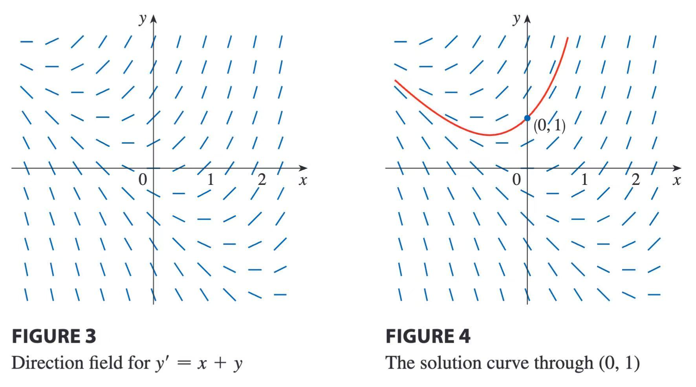
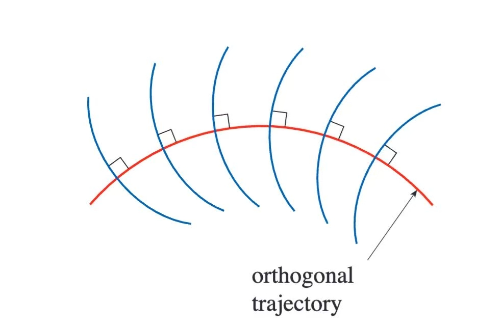

# 第九章：微分方程

> 《斯图尔特微积分》第九章：微分方程读书笔记。本章把导数关系写成方程，用微分方程描述种群、弹簧、电路和混合过程，并结合解析方法、方向场和欧拉法理解解的行为。

#### 本章地图

| 小节 | 核心问题 | 需要掌握的内容 |
| --- | --- | --- |
| 9.1 利用微分方程建模 | 怎样用变化率表达自然规律？ | 种群、弹簧、通解、初值问题 |
| 9.2 方向场与欧拉法 | 没有显式解时怎样理解解？ | 方向场、解曲线、欧拉迭代 |
| 9.3 分离变量法 | 可分离方程怎样求解？ | 变量分离、正交轨线、混合问题 |
| 9.4 种群增长模型 | 增长为何会受资源限制？ | 指数增长、逻辑斯谛方程、承载量 |
| 9.5 线性方程 | 一阶线性方程怎样系统求解？ | 积分因子、电路模型 |

---

## 9.1 利用微分方程建模

**引文**
我们通过对现象的直观推理或基于实验证据的物理规律来建立实际问题的数学模型，数学模型通常表示为微分方程。

微分方程：方程包含了一个未知函数及它的一些导数。

#### 种群增长模型

模型中的变量：

- $t$：时间（自变量）；
- $P$：种群的个体数量（因变量）。

种群规模增长率为导数 $\dfrac{dP}{dt}$ ，所以种群的增长率与种群规模成正比的假设可以表示为
$$\frac{dP}{dt}=kP$$
其中 $k$ 为比例常数。

#### 弹簧运动模型

$$\frac{d^2x}{dt^2}=-\frac{k}{m}x$$

#### 一般微分方程

**易错点**
解微分方程通常并不简单，没有方法可以解所有的微分方程。

**例题**
举例一个简单的微分方程：
$$y'=x^3$$
通解为：
$$y=\frac{x^4}{4}+C$$

- 应用微分方程时，通常不需要找到解族（通解），只需要找到一个满足特定附加条件的解。在许多物理问题中，解要满足形如 $y(t_{0})=y_{0}$ 的条件，这个条件称为**初值条件**，求微分方程满足初值条件的解的问题为**初值问题**。

例：已知函数族
$$y=\frac{1+ce^t}{1-ce^t}$$
中每个成员函数都是微分方程的解。
求微分方程 $y'=\dfrac{1}{2}(y^2-1)$ 满足初值条件 $y(0)=2$ 的解。
解：
将 $t=0,y=2$ 代入函数族，
$$2=\frac{1+ce^0}{1-ce^0}$$
$$c=\frac{1}{3}$$
$$y=\frac{3+e^t}{3-e^t}$$

---

## 9.2 方向场与欧拉法

大多数微分方程都不可能求出解的显式表达式。

#### 方向场

形如
$$y'=F(x,y)$$
的一阶微分方程，其中$F(x,y)$ 为关于 $x$ 和 $y$ 的表达式，这样的图像为方向场。

#### 欧拉法

设步长为 $h$ ，初值问题 $y'=F(x,y),y(x_{0})=y_{0}$ 的解在 $x_{n}=x_{n-1}+h$ 处的近似值为
$$y_{n}=y_{n-1}+hF(x_{n-1},y_{n-1}),n=1,2,3\dots$$

---

## 9.3 分离变量法

#### 可分离变量的微分方程

它是指这样的一阶微分方程：$\dfrac{dy}{dx}$ 可以分解为 $x$ 的函数乘以 $y$ 的函数的形式：
$$\frac{dy}{dx}=g(x)\times f(y)$$
令 $h(y)=\dfrac{1}{f(y)}$，则

$$
\frac{dy}{dx}=\frac{g(x)}{h(y)}
$$
$$h(y)dy=g(x)dx$$
$$\int h(y)dy=\int g(x)dx$$

**例题**
例1：
(a) 解微分方程 $\dfrac{dy}{dx}=\dfrac{x^2}{y^2}$
(b) 求该方程满足初值条件 $y(0)=2$ 的解。
解：
$$y^2dy=x^2dx$$
$$\int y^2dy=\int x^2dx$$
$$\frac{1}{3}y^3=\frac{1}{3}x^3+C$$
将 $y(0)=2$ 代入，
$$C=8$$
$$\frac{1}{3}y^3=\frac{1}{3}x^3+8$$
$$y=\sqrt[3]{ x^3+8 }$$

**例题**
例2：解微分方程
$$\frac{dy}{dx}=\frac{6x^2}{2y+\cos y}$$
解：
$$(2y+\cos y)dy=6x^2dx$$
$$\int(2y+\cos y)dy=\int 6x^2dx$$
$$y^2+\sin y=2x^3+C$$

#### 正交轨线

****正交轨线****
是指和曲线族中的每条曲线都正交的曲线。

例：求曲线族 $x=ky^2(k为任意常数)$ 的正交轨线。
解：
对方程两边求导，
$$1=2ky\frac{dy}{dx}$$
$$x=ky^2\implies k=\frac{x}{y^2}$$
$$1=2y\cdot \frac{x}{y^2} \frac{dy}{dx}\implies \frac{dy}{dx}=\frac{y}{2x}$$
正交轨线斜率为此的负倒数，
$$k_{1}=\frac{dy}{dx}=- \frac{2x}{y}\implies ydy=-2xdx$$
$$\int ydy=-\int2xdx$$
$$\frac{y^2}{2}=-x^2+C$$
**物理学中的应用**
静电场中的电力线和等势线正交，空气动力学中的流线和速度等位线正交。

#### 混合问题

**引文**
典型的混合问题涉及向固定容量的水箱中注入充分溶解的某种物质的溶液。

例：一个水箱中有20kg盐溶于5000L水后形成的溶液，将含盐0.03kg/L的盐水以25L/min的速度注入水箱，溶液充分混合后以同样的速度流出水箱，半个小时后，水箱中还有多少盐？

解：
令 $y(t)$ 表示 $t$ min后的盐量（单位：kg），给定 $y(0)=20$ ，
盐量的变化率等于进入速度减去排出速度：

$$
\frac{dy}{dt}=\text{进入速度}-\text{排出速度}
$$

其中

$$
\text{进入速度}=0.03\times 25=0.75\ \mathrm{kg/min}
$$

$$
\text{排出速度}
=\frac{y(t)}{5000}\times 25
=\frac{y(t)}{200}\ \mathrm{kg/min}
$$
$$\frac{dy}{dt}=0.75-\frac{y(t)}{200}$$
$$\int \frac{dy}{150-y}=\int \frac{dt}{200}$$
$$-\ln |150-y|=\frac{t}{200}+C$$
$$|150-y|=130e^{\frac{-t}{200}}$$
$$y(t)=150-130e^{\frac{-t}{200}}$$
30min后，盐量为：
$$y(30)=150-130^{\frac{-30}{200}} \approx38.1kg$$

---

## 9.4 种群增长模型

#### 自然增长定律

$$\frac{dP}{dt}=kP$$
$$\int \frac{dP}{P}=\int kdt$$
$$\ln |P|=kt+C$$
$$|P|=e^{kt+C}$$
$$P=Ae^{kt}$$

**初值问题**
$$\frac{dP}{dt}=kP,P(0)=P_{0}$$
解为：
$$P(t)=P_{0}e^{kt}$$

另一种种群迁移：如果迁移率是常数 $m$ ，那么种群规模的变化率可以用如下微分方程建模：

**小结**
$$\frac{dP}{dt}=kP-m$$

#### 逻辑斯谛模型

相对增长随种群规模 $P$ 的增大而减小，并在 $P$ 超过其环境容纳量 $M$ 时变为负，符合这些假设的相对增长率的最简单的表达式为：
$$\frac{dP/dt}{P}=k\left( 1-\frac{P}{M} \right)$$

**逻辑斯谛微分方程**
$$\frac{dP}{dt}=kP\left( 1-\frac{P}{M} \right)$$

$$
P(t)=\frac{M}{1+Ae^{-kt}},
\qquad
A=\frac{M-P_0}{P_0}
$$

---

## 9.5 线性方程

#### 线性微分方程

一阶线性微分方程：
$$\frac{dy}{dx}+P(x)y=Q(x)$$

**解题方法**
解线性微分方程 $y'+P(x)y=Q(x)$ 时，将方程两边同时乘以积分因子，然后对两边积分。
$$I(x)=e^{\int P(x)dx}$$

**例1：解微分方程**
$$\frac{dy}{dx}+3x^2y=6x^2$$
解：
$$P(x)=3x^2,Q(x)=6x^2$$
$$I(x)=e^{\int 3x^2dx}=e^{x^3}$$
$$e^{x^3} \frac{dy}{dx}+3x^2e^{x^3}y=6x^2e^{x^3}$$
$$\frac{d}{dx}(e^{x^3}y)=6x^2e^{x^3}$$
$$e^{x^3}y=\int6x^2e^{x^3}dx=2e^{x^3}+C$$
$$y=2+Ce^{-x^3}$$

**例2：求以下初值问题的解：**
$$x^2y'+xy=1,x>0,y(1)=2$$
解：
$$y'+\frac{1}{x}y=\frac{1}{x^2},x>0$$
$$I(x)=e^{\int \frac{1}{x}dx}=e^{\ln x}=x$$
$$
xy'+y=\frac{1}{x},
\qquad
(xy)'=\frac{1}{x}
$$
$$xy=\int \frac{1}{x}dx=\ln x+C$$
$$y=\frac{\ln x+C}{x}$$
代入 $y(1)=2$
$$2=\frac{\ln1+C}{1}=C$$
$$y=\frac{\ln x+2}{x}$$

**例3：解方程 $y'+2xy=1$**
解：
$$I(x)=e^{\int2xdx}=e^{x^2}$$
$$e^{x^2}y'+2xe^{x^2}y=e^{x^2}\implies (e^{x^2}y)'=e^{x^2}$$
$$e^{x^2}y=\int e^{x^2}dx+C$$
$$y=e^{-x^2}\int e^{x^2}dx+Ce^{-x^2}$$

#### 在电路上的应用

欧姆定律
由电阻器造成的电压降为 $RI$ ，由电感器造成的电压降为 $L\cdot (\dfrac{dI}{dt})$ ，总电压降等于电源电压 $E(t)$ :
$$L \frac{dI}{dt}+RI=E(t)$$

**例题**
例1：有一个电阻为 $12\Omega$ 的电阻器和一个电感为 $4H$ 的电感器，如果电池提供的恒定电压为 $60V$ ，当 $t=0$ 时开关闭合，电流从 $I(0)=0$ 开始变化。
(a) 求 $I(t)$ 
(b) $1s$ 后的电流
(c) 电流的极限值
解：
(a) 将 $L=4,R=12,E(t)=60$ 代入
$$4 \frac{dI}{dt}+12I=60,I(0)=0$$
积分因子为

$$
e^{\int 3\,dt}=e^{3t}
$$
$$e^{3t} \frac{dI}{dt}+3e^{3t}I=15e^{3t}$$
$$\frac{d}{dt}(e^{3t}I)=15e^{3t}$$
$$e^{3t}I=\int15e^{3t}dt=5e^{3t}+C$$
$$I(t)=5+Ce^{-3t}$$
将 $I(0)=0$ 代入
$$C=-5$$
$$I(t)=5(1-e^{-3t})$$
(b)
$$I(1)=5(1-e^{-3}) \approx4.75A$$
(c)
$$\lim_{ t \to +\infty }I(t)=\lim_{ t \to +\infty }5(1-e^{-3t})=5  $$

---

---

#### 本章总结

- 微分方程描述未知函数及其导数之间的关系。
- 初值条件从解族中选出符合具体情境的解。
- 方向场展示解曲线的局部斜率，欧拉法提供数值近似。
- 分离变量法适用于能够把 $x$ 与 $y$ 项分开的方程。
- 一阶线性方程可通过积分因子转化为乘积的导数。
