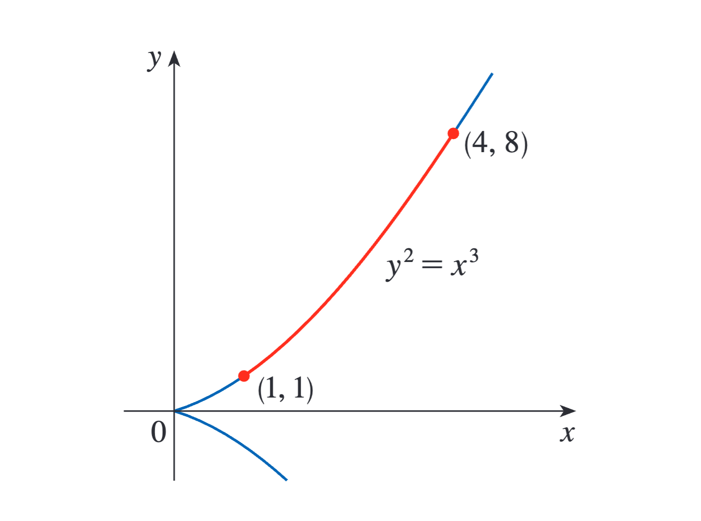
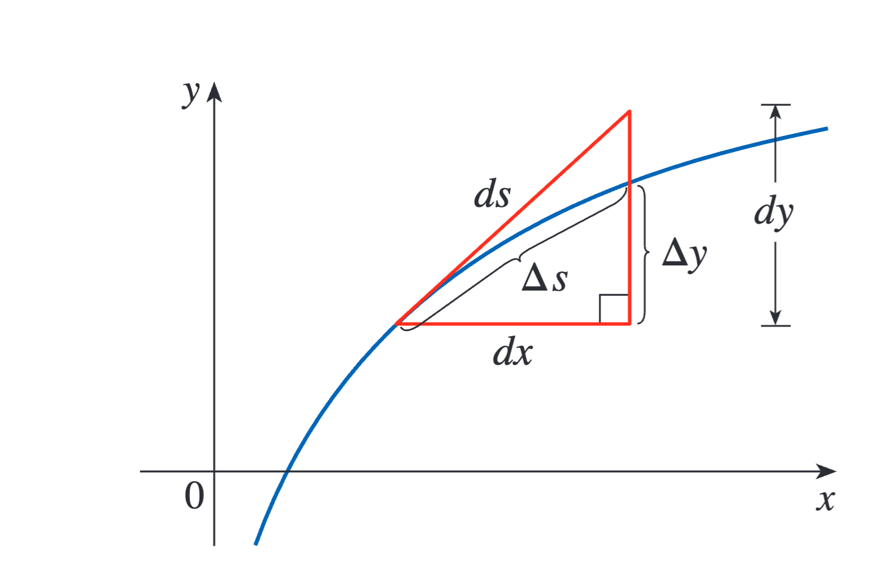
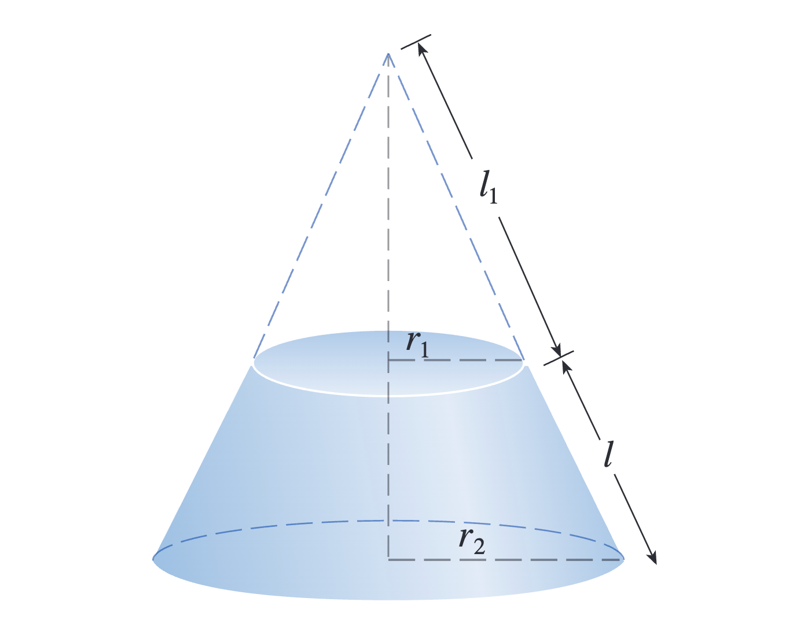
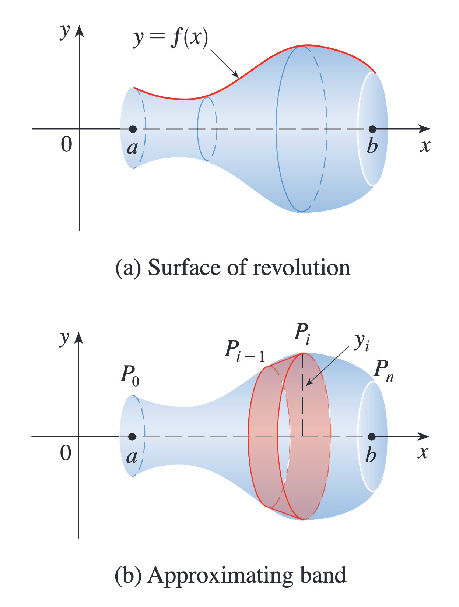
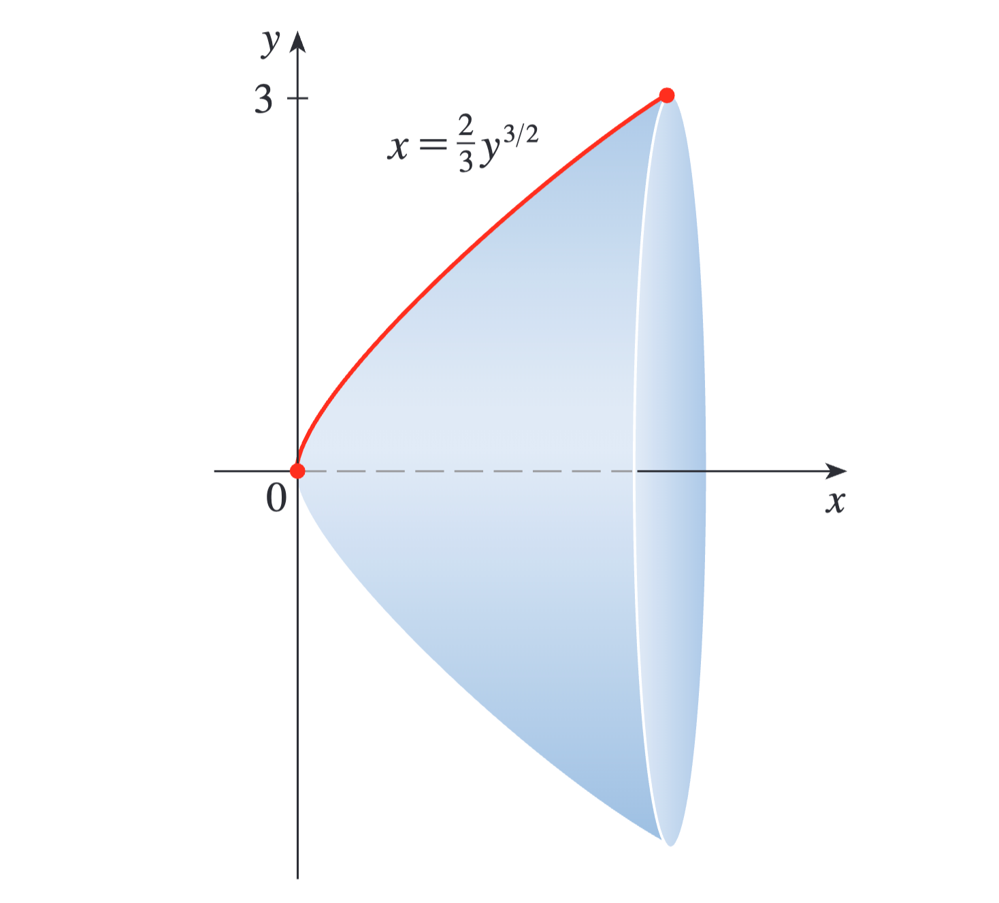
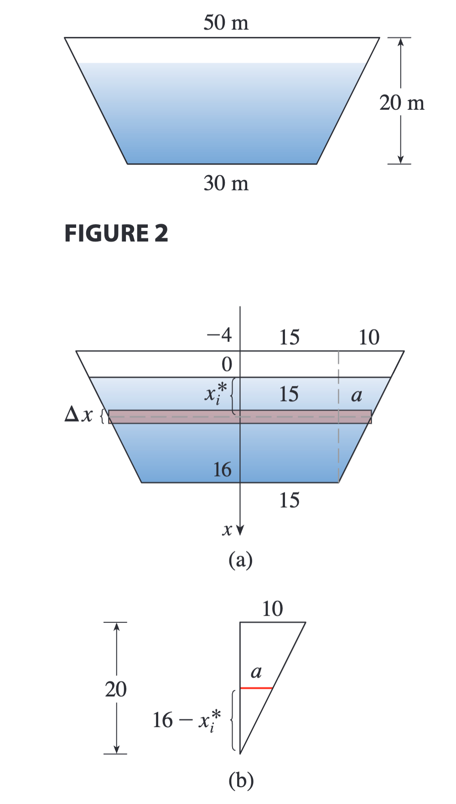
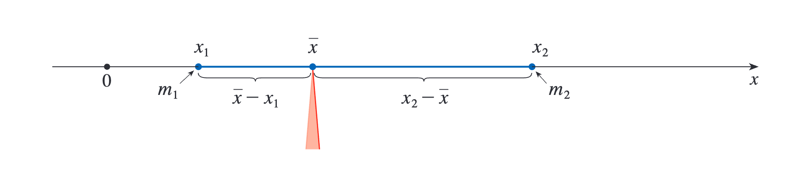
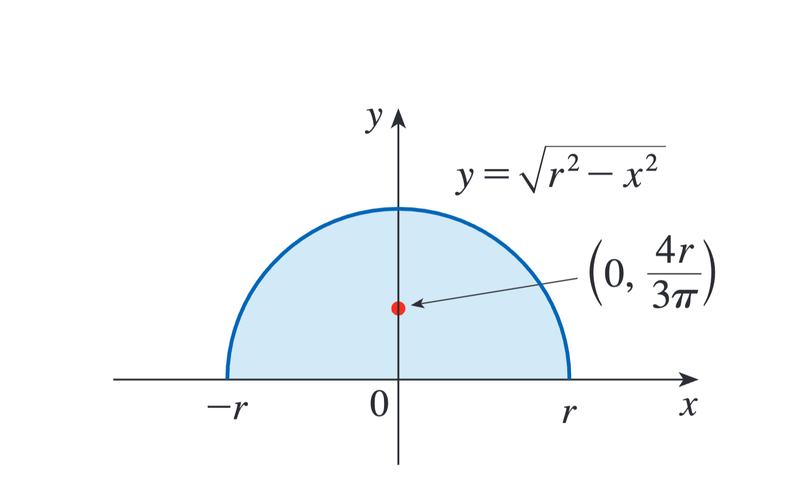
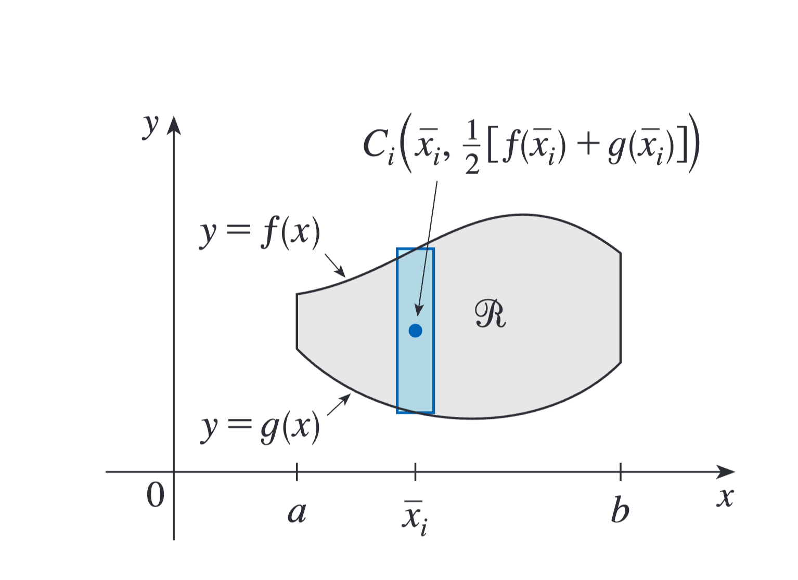

# 第八章：积分的进一步应用

> 《斯图尔特微积分》第八章：积分的进一步应用读书笔记。本章继续扩展积分的应用范围，从几何中的弧长和曲面面积，延伸到流体压力、质心、经济学、生物学与概率密度。

#### 本章地图

| 小节 | 核心问题 | 需要掌握的内容 |
| --- | --- | --- |
| 8.1 弧长的计算 | 曲线长度怎样由折线极限得到？ | 弧长公式、弧长函数 |
| 8.2 旋转曲面的面积 | 旋转曲面面积怎样累积？ | 表面积微元、绕坐标轴旋转 |
| 8.3 物理学和工程学中的应用 | 积分怎样描述连续物理量？ | 液体压力、矩、质心、帕普斯定理 |
| 8.4 经济学和生物学中的应用 | 积分怎样进入跨学科模型？ | 消费者剩余、血流量、心输出量 |
| 8.5 概率 | 连续随机变量怎样分配概率？ | 概率密度、均值、中位值、正态分布 |

---

## 8.1 弧长的计算

:::note[引文]

让一根线和曲线重合，然后用尺子测量线的长度，那么这个长度也就是曲线的长度，最初我们是这么设想的，但是当曲线变得复杂时，这种方法就不那么奏效了，此时，我们需要一种可以求解曲线长度的方法。

:::

#### 曲线的弧长

如果曲线是一条折线，我们很容易就可以求出它的长度，仅仅是几条线段相加就可以了。可以使用类似的方法，要定义一般曲线的长度，首先将其近似为一个折线轨迹，可以回想一下，曾经我们用圆内接多边形的边长之和的极限来求圆的周长。

:::warning[原讲义插图待补充]

原始笔记引用了 `8-1.1.png`，但当前目录中没有找到对应图片。正文与公式已保留，后续补入图片后可替换此提示。

:::

**小结**
$$L=\lim_{ n \to +\infty }\sum_{i=1}^n|P_{i-1}-P_{i}| $$
其中 $|P_{i-1}-P_{i}|$ 为 $P_{i-1}$ 和 $P_{i}$ 之间的距离。也就是很多折线的长度之和。

我们可以用积分推导出 $L$ 的一个公式：

令 $\Delta y_{i}=y_{i}-y_{i-1}$ ，那么
$$|P_{i-1}P_{i}|=\sqrt{ (x_{i}-x_{i-1})^2+(y_{i}-y_{i-1})^2 }=\sqrt{ (\Delta x)^2+(\Delta y_{i})^2 }$$

:::tip[公式]

弧长公式：

如果 $f'$ 在区间 $[a,b]$ 上连续，那么曲线 $y=f(x),a\leqslant x\leqslant b$ 的长度为

:::
$$L=\int_{a}^{b} \sqrt{ 1+[f'(x)]^2 } \, dx $$
也可以写为
$$L=\int_{a}^{b} \sqrt{ 1+\left( \frac{dy}{dx} \right)^2 } \, dx $$

**例题**
例1：求半立方抛物线 $y^2=x^3$ 在点 $(1,1)$ 和点 $(4,8)$ 之间的弧长

解：
$$y=x^{\frac{3}{2}}\implies y'=\frac{3}{2}x^{\frac{1}{2}}$$
$$L=\int_{1}^{4} \sqrt{ 1+\left( \frac{3}{2}x^{\frac{1}{2}} \right)^2 } \, dx =\int_{1}^{4} \sqrt{ 1+\frac{9}{4}x } \, dx $$
令 $u=1+\dfrac{9}{4}x$，则 $du=\dfrac{9}{4}\,dx$。当 $x=1$ 时，$u=\dfrac{13}{4}$；当 $x=4$ 时，$u=10$。
$$L=\frac{4}{9}\int_{\frac{13}{4}}^{10}\sqrt{ u }  \, du=\frac{4}{9}\times \frac{2}{3}u^{\frac{3}{2}}\bigg|_{\frac{13}{4}}^{10}=\frac{80\sqrt{ 10 }-13\sqrt{ 13 }}{27} $$

对于上述问题，如果曲线方程是 $x=g(y),c\leqslant y\leqslant d$ ，我们可以把 $x$ 和 $y$ 互换，得到如下变形公式：

:::tip[公式]

弧长公式变形

:::
$$L=\int_{c}^{d} \sqrt{ 1+[g'(y)]^2 } \, dy=\int_{c}^{d} \sqrt{ 1+\left( \frac{dx}{dy} \right)^2 } \, dy  $$

**例题**
例2：求抛物线 $y^2=x$ 在点 $(0,0)$ 和点 $(1,1)$ 之间的弧长。
解：
由 $x=y^2$ 可得

$$
\frac{dx}{dy}=2y
$$
$$L=\int_{0}^{1} \sqrt{ 1+(2y)^2 } \, dy=\int_{0}^{1} \sqrt{ 1+4y^2 } \, dy  $$
作三角换元

$$
y=\frac{1}{2}\tan\theta,
\qquad
dy=\frac{1}{2}\sec^2\theta\,d\theta
$$
$$\sqrt{ 1+4y^2 }=\sqrt{ 1+\tan^2\theta }=\sec\theta$$
当 $y=0$ 时，$\theta=0$；当 $y=1$ 时，$\tan\theta=2$，记 $A=\arctan 2$。
$$L=\int_{0}^{A} \sec\theta\cdot \frac{1}{2}\sec^2\theta \, d\theta=\frac{1}{2}\int_{0}^{A} \sec^3 \, d\theta  $$
$$L=\frac{1}{4}(\sec A\tan A+\ln |\sec A+\tan A|)$$
$$
\tan A=2,
\qquad
\sec^2 A=1+\tan^2 A=5
$$
$$L= \frac{\sqrt{ 5 }}{2}+\frac{\ln(\sqrt{ 5 }+2)}{4}$$

#### 弧长函数

如果用 $s(x)$ 表示曲线 $C$ 从起点 $P_{0}(a,f(a))$ 到终点 $Q(x,f(x))$ 的距离，则 $s$ 为一个函数，称为弧长函数：
$$s(x)=\int_{a}^{x} \sqrt{ 1+[f'(t)]^2 } \, dt $$
$$\frac{ds}{dx}=\sqrt{ 1+[f'(t)] }=\sqrt{ 1+\left( \frac{dy}{dx} \right)^2 }$$
$$ds=\sqrt{ 1+\left( \frac{dy}{dx} \right) }dx$$
也可以推导出：
$$ds=\sqrt{ 1+\left( \frac{dx}{dy} \right) }dy$$

**例题**
例3：求曲线 $y=x^2-\frac{1}{8}\ln x$ 以 $P_{0}(1,1)$ 为起点的弧长函数。
解：
$$y'=2x-\frac{1}{8x}$$
$$\sqrt{ 1+[f'(x)]^2 }=2x+\frac{1}{8x}$$
$$s(x)=\int_{1}^{x} \left( 2t+\frac{1}{8t} \right) \, dt =\left[ t^2+\frac{1}{8}\ln t \right]_{1}^x$$
$$s(x)=x^2+\frac{1}{8\ln x}-1$$

---

## 8.2 旋转曲面的面积

**小结**
圆锥体侧面积：
>
$$A=\pi rl$$
底面圆半径为 $r$ ，母线长为 $l$ 。

**小结**
圆台侧面积：
>
$$A=2\pi rl$$
其中 $r$ 为条带平均半径。

观察上图，它是由曲线 $y=f(x),a\leqslant x\leqslant b$ 绕 $x$ 轴旋转而成。
我们计算其中一个条带的面积：
母线长和平均半径分别为

$$
l=|P_{i-1}P_i|,
\qquad
r=\frac{1}{2}(y_{i-1}+y_i)
$$
$$ |P_{i-1}P_{i}|=\sqrt{ 1+[f'(x^*)]^2 }\Delta x$$
$$r=f(x_{i}^*)$$
$$A=2\pi |P_{i-1}P_{i}|\frac{1}{2}(y_{i-1}+y_{i})$$
那么，整个旋转曲面的面积为：
$$S=\sum_{i=1}^n2\pi f(x_{i}^*)\sqrt{ 1+f'(x_{i}^*)^2 }\Delta x$$

**小结**
旋转曲面面积公式：
>
由曲线 $y=f(x),a\leqslant x\leqslant b$ 绕 $x$ 轴旋转而成，
$$S=\int_{a}^{b} 2\pi f(x)\sqrt{ 1+[f'(x)]^2 } \, dx $$
$$S=\int_{a}^{b} 2\pi y\sqrt{ 1+\left( \frac{dy}{dx} \right)^2 } \, dx $$
绕 $x$ 轴变形为
$$S=\int_{c}^{d}2\pi y\sqrt{ 1+\left( \frac{dx}{dy} \right) }  \, dy $$

**例题**
例1：曲线 $y=\sqrt{ 4-x^2 },-1\leqslant x\leqslant1$ 是一段弧，求这段弧绕 $x$ 轴旋转所得曲面的面积。
解：
$$\frac{dy}{dx}=-\frac{x}{\sqrt{ 4-x^2 }}$$
$$S=\int_{-1}^{1} 2\pi y\sqrt{ 1+\left( \frac{dy}{dx} \right)^2 } \, dx $$
$$S=2\pi\int_{-1}^{1} \sqrt{ 4-x^2 }\sqrt{ 1+ \frac{x^2}{4-x^2} } \, dx $$
$$S=4\pi \int_{-1}^{1} 1 \, dx=4\pi \times 2=8\pi $$

例2：求曲线 $x=\frac{2}{3}y^{\frac{3}{2}}$ 在 $y=0$ 和 $y=3$ 之间的弧绕 $x$ 轴旋转所得曲面的面积。

解：
$$S=\int_{0}^{3} 2\pi y\sqrt{ 1+\left( \frac{dx}{dy} \right) } \, dy=2\pi \int_{0}^{3} y\sqrt{ 1+\left( y^{\frac{1}{2}} \right)^2 } \, dy  $$
$$S=2\pi \int_{0}^{3} y\sqrt{ 1+y } \, dy $$
令 $u=1+y,du=dy$
$$S=2\pi \int_{1}^{4} (u-1)\sqrt{ u } \, du=\frac{232}{15}\pi $$

---

## 8.3 物理学和工程学中的应用

#### 液体的压强和压力

**引文**
潜水员经验：越下潜，水的压力就越大，这是因为他们上方的水越来越重。

液体对平板的压力：
$$F=mg=\rho gAd$$
单位面积上所受压力：
$$P=\frac{F}{A}=\rho gd$$
**例题**
例1：梯形大坝高20m，顶部宽50m，底部宽30m，如果水位到坝顶的距离为4m，求流体静压强造成的大坝所受的力。
解：

建立坐标系，令 $x$ 轴垂直，向下为正方向，原点在水平面处，水深16m，将区间 $[0,16]$ 分成等宽子区间，端点为 $x_{i}$ ，样本点为 $x_{i}^*\in [x_{i-1},x_{i}]$ ，那么，大坝中的第 $i$ 个水平条形可以用高为 $\Delta x$ 、宽为 $w_{i}$ 的矩形来近似，
$$\frac{a}{16-x_{i}^*}=\frac{10}{20}\implies a=8-\frac{x_{i}^*}{2}$$
$$w_{i}=2(15+a)=46-x_{i}^*$$
第 $i$ 个条形的面积为 $A_{i}$ 
$$A_{i} \approx w_{i}\cdot\Delta x=(46-x_{i}^*)\Delta x$$
因为 $\Delta x$ 很小，那么第 $i$ 个条形上的压强 $P_{i}$ 几乎恒定的
$$P_{i}=1000gx_{i}^*$$
$$F_{i}=P_{i}A_{i}\approx1000gx_{i}^*(46-x_{i}^*)\Delta x$$
$$F=\lim_{ n \to +\infty }\sum_{i=1}^n1000gx_{i}^*(46-x_{i}^*)\Delta x $$
$$=\int_{0}^{16} 1000gx(46-x) \, dx=9800\left[ 23x^2-\frac{x^3}{3} \right]_{0}^{16} $$
$$\approx 4.43\times 10^7N$$

#### 物体的矩和质心

**引文**
在任意形状的薄板上找到一点 $P$ ，使得以这一点为支点，薄板可以维持水平平衡，这一点称为薄板的质心（重心）。

质心所在处：
$$\bar{x}=\frac{m_{1}x_{1}+m_{2}x_{2}}{m_{1}+m_{2}}$$
$$\bar{x}=\frac{\displaystyle\sum_{i=1}^nm_{i}x_{i}}{\displaystyle\sum_{i=1}^nm_{i}}=\frac{\displaystyle\sum_{i=1}^nm_{i}x_{i}}{m}$$
系统关于原点的矩：
$$M=\sum_{i=1}^nm_{i}x_{i}$$
系统关于 $y$ 轴的矩：
$$M_{y}=\sum_{i=1}^nm_{i}x_{i}$$
$$M_{y}=\lim_{ n \to +\infty }\sum_{i=1}^n\rho \bar{x}_{i}f(\bar{x}_{i})\Delta x=\rho \int_{a}^{b} xf(x) \, dx  $$
系统关于 $x$ 轴的矩：
$$M_{x}=\sum_{i=1}^nm_{i}y_{i}$$
$$M_{x}=\lim_{ n \to +\infty }\sum_{i=1}^n\rho \frac{1}{2}[f(\bar{x}_{i})]^2\Delta x=\rho \int_{a}^{b}  \frac{1}{2}[f(x)]^2 \, dx  $$

**质心位于点 $(\bar{x},\bar{y})$ 处：**
$$\bar{x}=\frac{1}{A}\int_{a}^{b} xf(x) \, dx ,\quad \bar{y}=\frac{1}{A}\int_{a}^{b}  \frac{1}{2}[f(x)]^2 \, dx $$

**例题**
例：求密度均匀的半径为 $r$ 的半圆形平板的质心。
解：

$$f(x)=\sqrt{ r^2-x^2 },a=-r,b=r$$
由对称性可知 $\bar{x}=0$。
$$A=\frac{1}{2}\pi r^2$$
$$\bar{y}=\frac{1}{A}\int_{-r}^{r} [f(x)]^2 \, dx =\dfrac{1}{\dfrac{1}{2}\pi r^2} \frac{1}{2}\int_{-r}^{r}(\sqrt{ r^2-x^2 })^2  \, dx $$
$$=\frac{2}{\pi r^2}\int_{0}^{r} (r^2-x^2) \, dx=\frac{4r}{3\pi} $$
质心为

$$
\left(0,\frac{4r}{3\pi}\right)
$$

如果区域 $R$ 位于曲线 $y=f(x)$ 和 $y=g(x)$ 之间，其中 $f(x)\geqslant g(x)$ ，那么：

:::tip[公式]

**形心**

:::
$$\bar{x}=\frac{1}{A}\int_{a}^{b} x[f(x)-g(x)] \, dx $$
$$\bar{y}=\frac{1}{A}\int_{a}^{b} ([f(x)]^2-[g(x)]^2) \, dx $$

#### 帕普斯定理

设 $R$ 为一个平面区域，它完全位于平面上直线 $l$ 的一侧，那么 $R$ 绕 $l$ 旋转所得立体的体积是 $R$ 的面积 $A$ 与 $R$ 的形心所经过 的距离 $d$ 的乘积。

$$V=A\times d$$

---

## 8.4 经济学和生物学中的应用

#### 消费者剩余

**消费者剩余**
对于给定的价格，一些购买商品的消费者本来愿意支付更多的钱，但他们因不必这样做而受益，消费者愿意支付的钱与消费者实际支付的钱的差额称为**消费者剩余**。

通过求出某商品所有购买者的总消费者剩余，经济学家可以评估市场对社会的总体效益。

在每个商品节约的金额 $\times$ 商品数量= $[p(x_{i})-P]\Delta x$

商品的总消费者剩余：
$$\int_{0}^{X} [p(x)-P] \, dx $$
几何解释：需求曲线下方和直线 $p=P$ 上方区域的面积。

**例题**
**例：某商品的需求函数**
$$p=1200-0.2x-0.0001x^2$$
**求销量为 $500$ 时的消费者剩余。**
>
解：
$$p|_{x=500}=1200-0.2\times 500-0.0001\times 500^2=1075$$
$$\int_{0}^{500} (1200-0.2x-0.0001x^2-1075) \, dx $$
$$\approx33333.33$$

#### 血流量

**公式**
层流定律：
$$v(r)=\frac{P}{4\eta l}(R^2-r^2)$$
泊肃叶定律：
$$F=\frac{\pi PR^4}{8\eta l}$$

#### 心输出量

经过测量点的燃料量近似为
$$
\text{浓度}\times\text{体积}
=c(t_i)(F\Delta t)
$$
**公式**
染料的总量
$$A=F\int_{0}^{T} c(t) \, dt $$
心输出量
$$F=\frac{A}{\displaystyle\int_{0}^{T}c(t)  \, dt }$$

---

## 8.5 概率

#### 概率密度函数

每个连续随机变量 $X$ 都有一个概率密度函数 $f$ ，这表示 $X$ 在 $a$ 和 $b$ 之间的概率为 $f$ 从 $a$ 到 $b$ 的积分：
$$P(a\leqslant X\leqslant b) =\int_{a}^{b} f(x) \, dx $$

#### 均值和中位值

一般来说，我们将任何概率密度函数 $f$ 的均值定义为
$$\mu=\int_{-\infty}^{+\infty} xf(x) \, dx $$

#### 正态分布

正态分布是指随机变量 $X$ 的概率密度函数是一下函数族中的一个成员函数：
$$f(x)=\frac{1}{\sigma \sqrt{ 2\pi }}e^{\frac{-(x-\mu)^2}{2\sigma^2}}$$

---

#### 本章总结

- 弧长来自折线长度之和的极限，其微元包含水平与竖直变化。
- 旋转曲面面积由周长与弧长微元的乘积累积得到。
- 压力、质心等问题需要先建立正确的连续分布模型。
- 积分可以表示消费者剩余、血流量与心输出量等跨学科量。
- 概率密度曲线下的面积给出连续随机变量落在区间内的概率。
