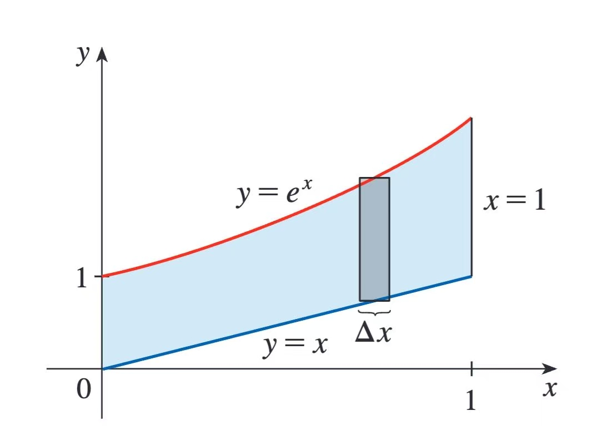
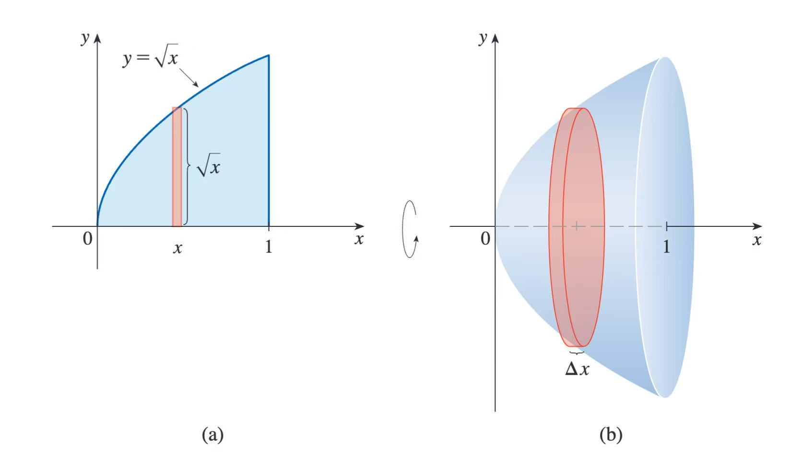
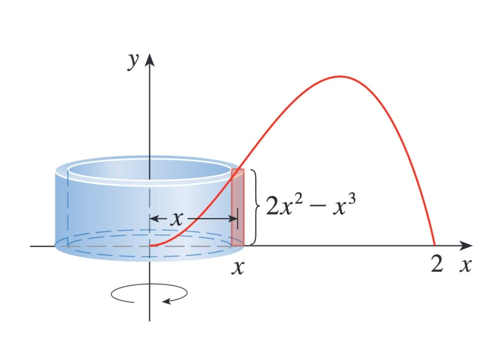
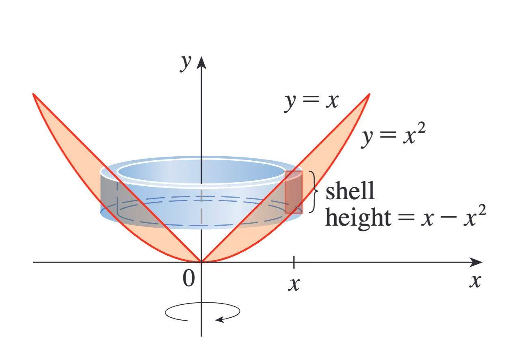
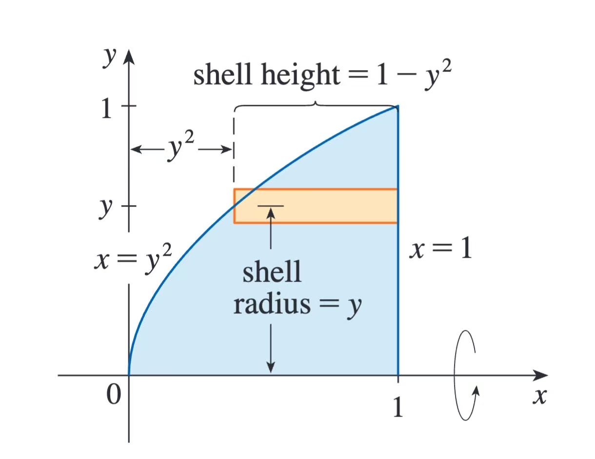

# 第六章：积分的应用

> 《斯图尔特微积分》第六章：积分的应用读书笔记。本章把定积分作为累积工具，用于计算曲线间面积、立体体积、变力做功和函数平均值，并强调正确选择积分变量与切片方式。

#### 本章地图

| 小节 | 核心问题 | 需要掌握的内容 |
| --- | --- | --- |
| 6.1 曲线间的面积 | 两条曲线之间的面积怎样计算？ | 上下边界、左右边界、分段积分 |
| 6.2 体积 | 怎样由截面积累积立体体积？ | 切片法、圆盘法、圆环法 |
| 6.3 柱壳法求体积 | 何时使用圆柱壳更简单？ | 壳半径、壳高、旋转轴 |
| 6.4 功 | 变力做功怎样累积？ | 弹簧、抽水、连续质量分布 |
| 6.5 函数的平均值 | 连续函数的平均水平是什么？ | 积分平均值、中值定理 |

---

## 6.1 曲线间的面积
:::note[引文]

我们定义并计算了函数下方区域的面积，现在我们利用积分求两个函数的图像之间的区域面积。

:::

定义面积 $A$ 为近似矩形面积之和的极限：
$$
A=\lim_{n\to\infty}\sum_{i=1}^n
\left[f(x_i^*)-g(x_i^*)\right]\Delta x
$$

#### 曲线间的面积：求关于 $x$ 的积分

:::tip[小结]

- 曲线 $y=f(x)$ 和 $y=g(x)$ 以及直线 $x=a$ 和 $x=b$ 所围成区域的面积为

$$A=\int_{a}^{b} |f(x)-g(x)| \, dx $$

$$
A=
\text{$y=f(x)$ 下方区域的面积}
-
\text{$y=g(x)$ 下方区域的面积}
$$
$$A=\int_{a}^{b} f(x) \, dx -\int_{a}^{b} g(x) \, dx $$

:::

:::info[例题]

- 例1:求 $y=e^x、y=x、x=0、x=1$ 所围成区域的面积。
解：
上边界为曲线 $y=e^x$，下边界为直线 $y=x$，利用面积公式

$$
A=\int_{0}^{1}(e^x-x)\,dx
=\left[e^x-\frac{x^2}{2}\right]_{0}^{1}
=e-\frac{3}{2}
$$

:::

#### 曲线间的面积：求关于 $y$ 的积分

:::info[重点]

- 通过将 $x$ 表示为 $y$ 的函数，可以更好地进行计算,如果一个区域由 $x=f(y)、x=g(y)、y=c、y=d$ 围成，那么该区域

$$A=\int_{c}^{d} [f(y)-g(y)] \, dy $$

:::

:::warning[注意]

如果用 $x_{R}$ 表示右边界，$x_{L}$ 表示左边界，那么

$$A=\int_{c}^{d} (x_{R}-x_{L}) \, dy $$
这里需要注意，我们使用右边界减去左边界。

:::

:::info[例题]

- 例2:求直线 $y=x-1$ 和抛物线 $y^2=2x+6$ 所谓成区域的面积。
解：
联立方程求交点为$(-1.-2),(5,4)$ 

$\begin{aligned} &\quad A=\int_{-2}^{4} \left[ (y+1)-\left( \frac{1}{2}y^2-3 \right) \right] \, dy=\left[ -\frac{1}{2} \frac{y^3}{3}+\frac{y^2}{2}+4y \right]\bigg|_{-2}^4=18 \end{aligned}$

:::

:::warning[原讲义插图待补充]

原始笔记引用了 `6-2.png`，但当前目录中没有找到对应图片。正文与公式已保留，后续补入图片后可替换此提示。

:::

## 6.2 体积

#### 体积的定义

- 柱体的体积定义：
$$
\text{体积}=\text{底面积}\times\text{高},
\qquad
V=Ah
$$

- 令 $S$ 为介于 $x=a$ 和 $x=b$ 之间的立体，如果 $S$ 在过点 $x$ 、垂直于 $x$ 轴的平面 $P_{x}$ 上的截面的面积为 $A(x)$ ，其中 $A$ 为连续函数，则 $S$ 的体积为
$$V=\lim_{ n \to \infty } \sum_{i=1}^n A(x_{i}^*)\Delta x=\int_{a}^{b} A(x) \, dx $$

#### 旋转体的体积

:::note[引文]

如果将一个区域绕直线旋转，就会得到一个旋转体。

:::

**例 1：求曲线 $y=\sqrt{x}$ 下方从 $x=0$ 到 $x=1$ 的区域绕 $x$ 轴旋转所得立体的体积。**

解：
$$A(x)=\pi (\sqrt{ x })^2=\pi x$$
$$\begin{aligned} &\quad V=\int_{0}^{1} A(x) \, dx=\int_{0}^{1} \pi x \, dx=\pi \left[ \frac{x^2}{2} \right]_{0}^1=\frac{\pi}{2}   \end{aligned}$$

## 6.3 柱壳法求体积

#### 柱壳法

其中，壳的厚度：$\Delta r=r_{2}-r_{1}$ 。壳的平均半径：$r=\frac{1}{2}(r_{2}+r_{1})$ ，那么柱壳的体积公式为
$$V=2\pi rh \Delta r$$
可以表述为
$$
V=\text{周长}\times\text{高}\times\text{厚度}
$$
**小结**
曲线 $y=f(x)$ 下方从 $x=a$ 导 $x=b$ 的区域绕 $y$ 轴旋转所得立体的体积为
当 $0\leqslant a\leqslant b$ 时，

$$
V=\int_a^b 2\pi x f(x)\,dx
$$
上式中，周长为 $2\pi x$ ，高为 $f(x)$ ，厚度为 $dx$ 。

**例题**
例1：求曲线 $y=2x^2-x^3$ 和直线 $y=0$ 围成的区域绕 $y$ 轴旋转所得立体的体积。
解：
代入公式，
$$V=\int_{0}^{2}(2\pi x)(2x^2-x^3)  \, dx=\frac{16}{5}\pi $$

**例题**
例2：求直线 $y=x$ 和曲线 $y=x^2$ 围成区域绕 $y$ 轴所得立体的体积。
解：
代入公式，
$$V=\int_{0}^{1} (2\pi x)(x-x^2) \, dx=\frac{\pi}{6} $$

**例题**
例3：求曲线 $y=\sqrt{ x }$ 下方从 $x=0$ 到 $x=1$ 的区域绕 $x$ 轴旋转所得立体的体积。
解：
将 $y=\sqrt{ x }$ 写成 $x=y^2$ ，绕 $x$ 轴旋转，柱壳半径为 $y$ ，周长为 $2\pi y$ ，高为 $1-y^2$ ，体积为
$$V=\int_{0}^{1} (2\pi y)(1-y^2) \, dx=\frac{\pi}{2} $$

---

## 6.4 功

:::note[引文]

- 由牛顿第二定律，物体所受的力 $F$ 等于物体质量 $m$ 与物体加速度 $a$ 的乘积：

$$F=ma=m \frac{d^2s}{dt^2}$$

:::

:::tip[小结]

- 功等于力和距离的乘积：

$$W=Fd$$
>- 如果力为 $f(x)$ ，定义使物体从 $a$ 移动到 $b$ 所做的功为 $n\to +\infty$ 时这个近似的极限：
$$W=\lim_{ n \to \infty } \sum_{i=1}^n f(x_{i}^*)\Delta x=\int_{a}^{b} f(x) \, dx $$

:::

**例题**
例1：设物体在距离原点 $x$ 处时所受力为 $f(x)=x^2+2x$ ，求使它从 $x=1$ 移动到 $x=3$ 所做的功。
解：
$$W=\int_{1}^{3} (x^2+2x) \, dx=\frac{50}{3} $$

- 胡克定律：弹簧伸长 $x$ 个单位所需的拉力与弹簧的弹性系数成正比。
$$f(x)=kx$$

**例题**
例2：弹簧从自然长度10cm伸长到15cm需要40N的力，则使其从15cm伸长到18cm需要做多少功？
解：
$$k=\frac{40}{0.15-0.1}=800$$
$$W=\int_{0.05}^{0.08} 800x \, dx =1.56J$$

---

## 6.5 函数的平均值

**小结**
平均值：定义函数 $f$ 在区间 $[a,b]$ 上的平均值为
$$f_{avg} =\frac{1}{b-a}\int_{a}^{b} f(x) \, dx $$

**例题**
例1：求函数 $f(x)=1+x^2$ 在区间 $[-1,2]$ 上的平均值。
解：
$$f_{a vg}=\frac{1}{b-a}\int_{a}^{b} f(x) \, dx=\frac{1}{3}\int_{-1}^{2} (1+x^2) \, dx  $$
$$=\frac{1}{3}\left[ x+\frac{x^3}{3} \right]_{-1}^2=2$$

:::note[**积分中值定理**]

如果 $f$ 在区间 [a,b] 上连续，那么 [a,b] 内一定存在 $c$ ，使得
$$f(c)=f_{avg}=\frac{1}{b-a}\int_{a}^{b} f(x) \, dx $$
$$\int_{a}^{b} f(x) \, dx=f(c)(b-a) $$

几何理解：对于正值函数 $f$ ，存在一个数 $c$ 使得以 [a,b] 为底、$f(c)$ 为高的矩形的面积等于 $f$ 的图像下方区域从 $a$ 到 $b$ 的面积。

:::

---

#### 第六章复习

- 求下列给定曲线货直线所围成的面积。
$\begin{aligned} (1)&\quad y=x^2,y=8x-x^2 \end{aligned}$
解：
联立方程，可得交点为$(0,0),(4,2)$
求面积：
$$S=\int_{0}^{4} (8x-x^2-x^2) \, dx =\left[ 4x^2-\frac{2}{3}x^3 \right]_{0}^4=\frac{64}{3}$$

- 求给定曲线或直线围成的区域绕指定直线旋转所得立体的体积。
$\begin{aligned} (2)&\quad y=2x,y=x^2;绕x轴旋转 \end{aligned}$
解：
联立方程，可得交点 $(0,0),(2,4)$
外径：$R(x)=2x$ ，内径：$r(x)=x^2$
$$V=\int_{0}^{2} \pi(4x^2-x^4) \, dx=\left[ \frac{4}{3}x^3-\frac{1}{5}x^5 \right]_{0}^2\pi=\frac{64\pi}{15} $$

$\begin{aligned} (3)&\quad x=1+y^2,y=x-3;绕y轴旋转 \end{aligned}$
解：
联立方程，求交点$(5,2),(2,-1)$
$$V=\int_{-1}^{2} 2\pi[(y+3)-(1+y^2)]y \, dy=\left[ \frac{3}{2}y^2-\frac{1}{4y^3}_{-1}^2 \right]=\frac{3\pi}{2} $$

$\begin{aligned} (4)&\quad y=x^2+1,y=9-x^2;绕y=-1旋转 \end{aligned}$
解：
根据原判法体积公式，
$$V=\pi \int_{a}^{b} [R^2(x)-r^2(x)] \, dx $$
$$R(x)=10-x^2$$
$$r(x)=x^2+2$$
被积函数时偶函数，
$$V=2\pi \int_{0}^{2} [(10-x^2)^2-(x^2+2)^2] \, dx=2\pi \int_{0}^{2} (96-24x^2) \, dx  $$
$$V=2\pi[96x-8x^2]_{0}^2=256\pi$$

---

#### 本章总结

- 面积计算始终遵循“上减下”或“右减左”，必要时应分段。
- 体积的统一思想是把微小截面积累积起来。
- 圆盘、圆环和柱壳法的关键在于切片方向与旋转轴的关系。
- 变力做功是力关于位移的积分。
- 函数平均值把离散平均推广到连续区间。
