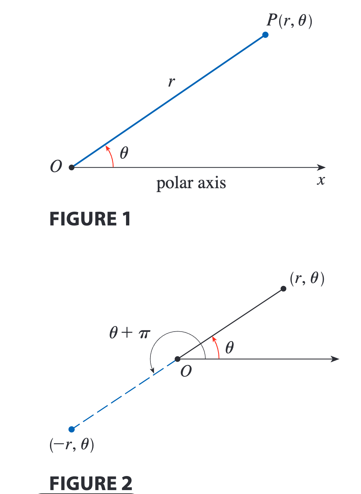
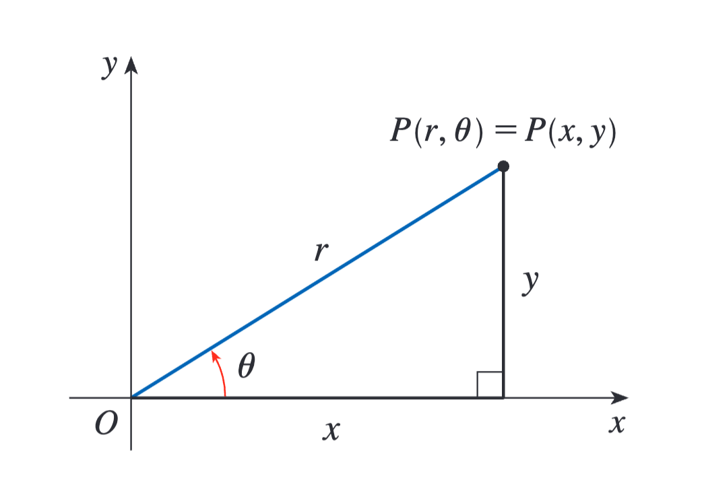
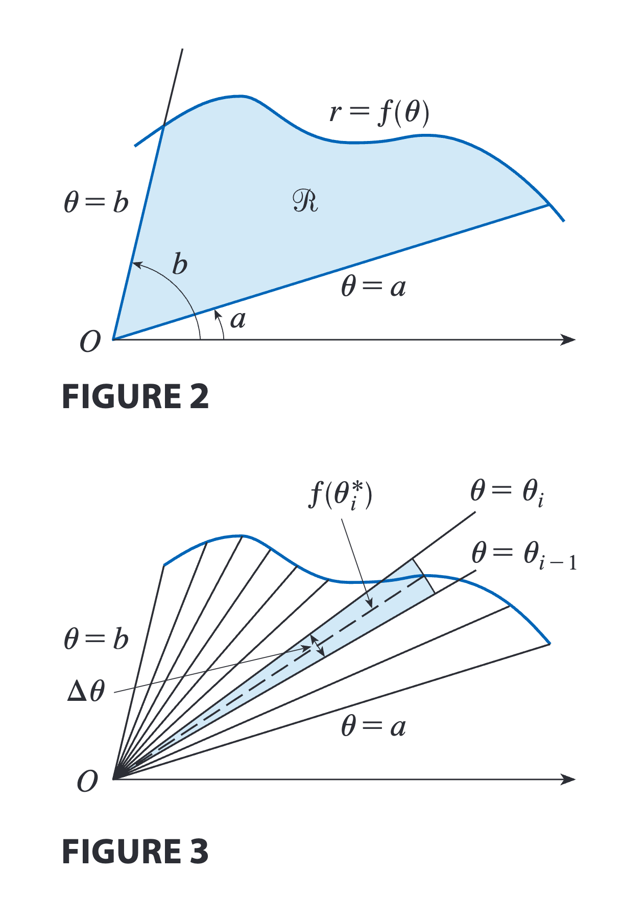
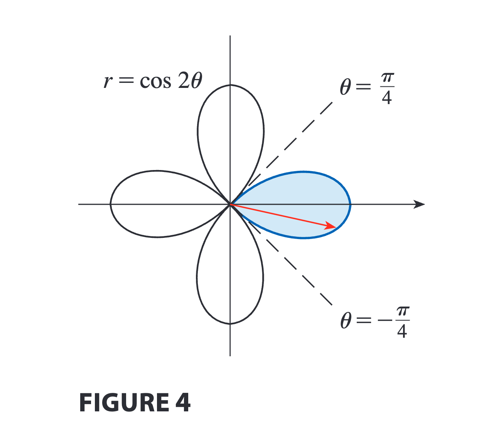
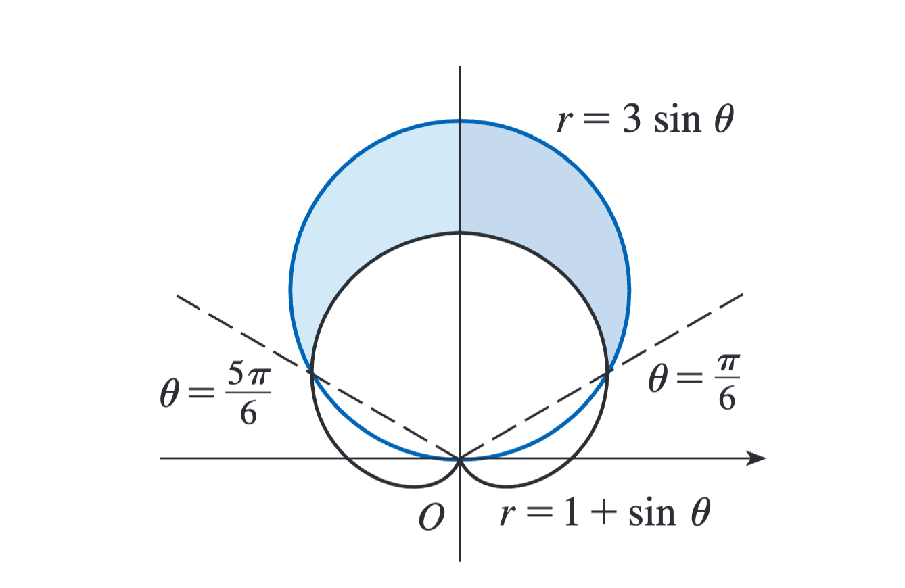

# 第十章：参数方程与极坐标

> 《斯图尔特微积分》第十章：参数方程与极坐标读书笔记。本章引入参数和极坐标两种描述曲线的语言，并把导数、面积、弧长和曲面面积公式迁移到新的坐标表示中。

#### 本章地图

| 小节 | 核心问题 | 需要掌握的内容 |
| --- | --- | --- |
| 10.1 由参数方程定义的曲线 | 怎样用第三个变量描述运动轨迹？ | 参数方程、消参、方向、旋轮线 |
| 10.2 参数曲线的微积分 | 参数曲线怎样求导和积分？ | 切线、二阶导数、面积、弧长、曲面面积 |
| 10.3 极坐标系 | 怎样用距离和方向定位点？ | 极坐标、坐标转换、极坐标图形 |
| 10.4 极坐标下的微积分 | 极坐标曲线怎样计算几何量？ | 面积、弧长、切线 |
| 10.5 圆锥曲线 | 圆锥曲线有哪些统一性质？ | 抛物线、椭圆、双曲线、平移 |
| 10.6 极坐标下的圆锥曲线 | 怎样统一描述圆锥曲线轨道？ | 焦点准线定义、离心率、开普勒定律 |

---

## 10.1 由参数方程定义的曲线

对于复杂曲线 $C$ 我们需要引入第三变量来进行描述。

#### 参数方程

假设 $x$ 和 $y$ 都是第三个变量 $t$ 的函数，
$$x=f(t),\qquad y=g(t)$$
坐标 $(x,y)=(f(t),g(t))$ 描绘的曲线称为**参数曲线**。

**例1：参数方程定义曲线：**
$$x=t^2-2t,y=t+1$$
$$x=t^2-2t=(y-1)^2-2(y-1)=y^2-4y+3$$
$$x=y^2-4y+3$$
我们求出了 $x$ 和 $y$ 的笛卡儿方程，消掉参数的过程称之为**消参**。

一般参数方程：
$$x=f(t),y=g(t),a\leqslant t\leqslant b$$
对应的曲线以 $(f(a),g(a))$ 为起点，以 $(f(b),g(b))$ 为终点。

圆心为 $(h,k)$ ,半径为 $r$ 的圆的参数方程。
$$x=h+r\cos t,\qquad y=k+r\sin t,\qquad 0\leqslant t\leqslant 2\pi$$

#### 旋轮线

:::warning[原讲义插图待补充]

原始笔记引用了 `10-1.1.png`，但当前目录中没有找到对应图片。正文与公式已保留，后续补入图片后可替换此提示。

:::

参数方程：
$$x=r(\theta-\sin\theta),y=r(1-\cos\theta),\theta \in \mathbb{R}$$
这条曲线与最速降线问题产生联系。

#### 参数曲线族

参数方程：
$$x=a+\cos t,y=a\tan t+\sin t$$
这些曲线由古希腊学者尼克米迪斯命名为蚌线。

## 10.2 参数曲线的微积分

#### 切线

链式法则：
$$\frac{dy}{dt}=\frac{dy}{dx}\cdot \frac{dx}{dt}$$
如果 $\dfrac{dx}{dt}\neq 0$，则

$$
\frac{dy}{dx}
=\frac{\dfrac{dy}{dt}}{\dfrac{dx}{dt}}
$$
$$\frac{d^2y}{dx^2}=\frac{d}{dx}\left( \frac{dy}{dx} \right)=\frac{\dfrac{d}{dt}\left( \dfrac{dy}{dx} \right)}{\dfrac{dx}{dt}}$$
**例题**
例1：曲线 $C$ 由参数方程 $x=t^2,y=t^3-3t$ 定义。
(a) 证明 $C$ 在点 $(3,0)$ 处有两条切线，求它们的方程。
(b) 求 $C$ 在哪些点处的切线是水平的或垂直的。
(c) 确定曲线上凹还是下凹。
解：

:::warning[原讲义插图待补充]

原始笔记引用了 `10-2.1.png`，但当前目录中没有找到对应图片。正文与公式已保留，后续补入图片后可替换此提示。

:::

(a)在点 $(3,0)$ 处，
$$x=t^2=3$$
$$y=t^3-3t=0$$
求得：
$$t=\pm \sqrt{ 3 }$$
$$\frac{dy}{dx}=\frac{3t^2-3}{2t}=\pm \sqrt{ 3 }$$
切线方程：
$$y=\sqrt{ 3 }(x-3),y=1\sqrt{ 3 }(x-3)$$
(b)当 $\dfrac{dy}{dx}=0$ ，即 $\dfrac{dy}{dt}=0$ ，且 $\dfrac{dx}{dt}\neq 0$ ，存在水平切线。
$$\frac{dy}{dt}=3t^2-3=0\implies t=\pm 1$$
此时，对应点为 $(1,-2),(1,2)$。
当 $\dfrac{dx}{dt}=2t=0$ ，存在垂直切线，对应点为 $(0,0)$。
(c)求二阶导数
$$\frac{d^2y}{dx^2}=\frac{\dfrac{6t^2+6}{4t^2}}{2t^2}=\frac{3t^2+3}{4t^3}$$
因此，当 $t>0$ 时曲线上凹，当 $t<0$ 时曲线下凹。

**例题**
例2：
(a) 求旋轮线 $x=r(\theta-\sin\theta),y=r(1-\sin\theta)$ 在点 $\theta=\dfrac{\pi}{3}$ 处的切线。
(b)哪些点处的切线时水平？哪些是垂直的？
解：
(a)切线斜率：
$$\frac{dy}{dx}=\frac{r\sin\theta}{r(1-\cos\theta)}=\frac{\sin\theta}{1-\cos\theta}=\sqrt{ 3 }$$
当 $\theta=\frac{\pi}{3}$ 时，
$$x=r\left( \frac{\pi}{3}-\frac{\sqrt{ 3 }}{2} \right),y=r\left( 1-\cos \frac{\pi}{3} \right)=\frac{r}{2}$$
切线方程为
$$y-\frac{r}{2}=\sqrt{ 3 }\left( x-\frac{r\pi}{3}+\frac{r\sqrt{ 3 }}{2} \right)$$

:::warning[原讲义插图待补充]

原始笔记引用了 `10-2.2.png`，但当前目录中没有找到对应图片。正文与公式已保留，后续补入图片后可替换此提示。

:::

(b) 当 $\dfrac{dy}{dx}=0$ 时，切线是水平的
$$
\sin\theta=0,
\qquad
1-\cos\theta\neq 0
$$
即 $\theta=(2n-1)\pi$ , $n$ 为整数，旋轮线上对应的点为 $((2n-1)\pi,2r)$ 。
当 $\theta=2n\pi$ 时，$\dfrac{dx}{d\theta}$ 和 $\dfrac{dy}{d\theta}$ 都为 0，此时存在垂直切线。
此时， $x=2n\pi r$

#### 面积

参数方程：$x=f(t),y=g(t),\alpha \leqslant t\leqslant \beta$ 

**新面积公式：**
$$A=\int_{\alpha}^{\beta} g(t)f'(t) \, dt $$

**例题**
例：求旋轮线 $x=r(\theta-\sin\theta),y=r(1-\cos\theta)$ 的一个拱下方的面积。
解：
旋轮线一个拱在 $(0,2\pi)$ 内，$dx=r(1-\cos\theta)d\theta$
$$A=\int_{0}^{2\pi r} y \, dx=\int_{0}^{2\pi} r(1-\cos\theta)r(1-\cos\theta) \, d\theta  $$
$$=r^2\int_{0}^{2\pi}(1-\cos\theta)^2  \, d\theta =r^2\int_{0}^{2\pi} \left[ 1-2\cos\theta+\frac{1}{2}(1+\cos2\theta) \right] \, d\theta $$
$$=r^2\left[ \frac{3}{2}\theta-2\sin\theta+\frac{1}{4}\sin 2\theta \right]_{0}^{2\pi}=r^2\left( \frac{3}{2}2\pi \right)=3\pi r^2$$

#### 弧长

初始弧长公式：
$$L=\int_{a}^{b} \sqrt{ 1+\left( \frac{dy}{dx} \right)^2 } \, dx $$
**参数方程弧长公式：**
$$L=\int_{\alpha}^{\beta} \sqrt{ \left( \frac{dx}{dt} \right)^2+\left( \frac{dy}{dt} \right)^2 } \, dt $$

$$s(t)=\int_{a}^{t}\sqrt{ \left( \frac{dx}{du}^2 \right)+\left( \frac{dy}{du} \right)^2 }  \, du $$
$$v(t)=s'(t)=\sqrt{ \left( \frac{dx}{dt} \right)^2+\left( \frac{dy}{dt} \right)^2 }$$
例：粒子在 $t$ 时的位置由参数方程 
$$x=2t+3,y=4t^2,t\geqslant 0$$
求粒子在点 $(5,4)$ 处时的速率。
解：

$$v(t)=\sqrt{ 2^2+(8t)^2 }=2\sqrt{ 1+16t^2 }$$
当 $t=1$ 时，粒子在点 $(5,4)$ 处，所以此时的速度为 $v(1)=2\sqrt{ 17 }\approx 8.25$ 。

#### 曲面面积

**曲面面积公式**
假设将参数方程 $x=f(t),y=g(t),\alpha \leqslant t\leqslant \beta(f',g'连续且g(t)\geqslant 0)$ 所表示的曲线绕 $x$ 轴旋转，那么所得曲面的面积由下式给出：
$$S=\int_{\alpha}^{\beta} 2\pi y\sqrt{ \left( \frac{dx}{dt} \right)^2+\left( \frac{dy}{dt} \right)^2 } \, dt $$

例：证明半径为 $r$ 的球面的面积为 $4\pi r^2$ 。
证明：
球面是由半圆
$$x=r\cos t,y=r\sin t,0\leqslant t\leqslant \pi$$
绕 $x$ 轴旋转得到的：
$$S=\int_{0}^{\pi} 2\pi r\sin t\sqrt{ (-r\sin t)^2+(r\cos t)^2 } \, dt $$
$$=2\pi \int_{0}^{\pi} r\sin t\sqrt{ r^2(\sin^2t+\cos^2t) } \, dt=2\pi \int_{0}^{\pi}r\sin t\cdot r  \, dt  $$
$$=2\pi r^2\int_{0}^{\pi} \sin t \, dt=2\pi r^2(-\cos t)\bigg|_{0}^\pi=4\pi r^2 $$

---

## 10.3 极坐标系

:::note[笛卡儿坐标]

坐标系用称作坐标的有序数对表示平面上的点。

:::

#### 极坐标系

平面中选择一点，称为**极点**，记作 $O$ ，然后从 $O$ 出发画一条射线，称为**极轴**，极轴通常是水平向右的，对应笛卡儿坐标系的 $x$ 轴正半轴。

:::note[说明]

夹角从极轴的逆时针方向测量为正值。

:::

如果 $r>0$ ，那么点 $(r,\theta)$ 位于与 $\theta$ 相同的象限；如果 $r<0$ 那么点 $(r,\theta)$ 位于相反方向的象限。

#### 极坐标与笛卡儿坐标之间的关系

笛卡儿坐标：
$$x=r\cos\theta,y=r\sin\theta$$
$$r^2=x^2+y^2,\tan\theta=\frac{y}{x}$$
**例题**
例：将点 $\left( 2, \dfrac{\pi}{3} \right)$ 从极坐标转化为笛卡儿坐标。
解：
$$x=r\cos\theta=2\cos \frac{\pi}{3}=2\times \frac{1}{2}=1$$
$$y=r\sin\theta=2\sin \frac{\pi}{3}=2\times \frac{\sqrt{ 3 }}{2}=\sqrt{ 3 }$$
因此，该点的笛卡儿坐标为 $(1,\sqrt{ 3 })$

---

## 10.4 极坐标下的微积分

#### 面积

扇形面积公式：
$$A=\frac{1}{2}r^2\theta$$

$$A=\int_{a}^{b} \frac{1}{2}r^2 \, d\theta =\int_{a}^{b} \frac{1}{2}[f(\theta)]^2 \, d\theta $$
**例题**
例：求四叶玫瑰线 $x=\cos 2\theta$ 的其中一叶所围成的面积。

解：
$$A=\int_{-\frac{\pi}{4}}^{\frac{\pi}{4}} \frac{1}{2}\cos^2 2\theta  \, d\theta=\frac{1}{2}\int_{0}^{\frac{\pi}{4}} (1+\cos 4\theta) \, d\theta=\frac{\pi}{8}  $$

**例题**
例：求圆 $r=3\sin\theta$ 内部、心脏线 $r=1+\sin\theta$ 外部的区域面积。

解：
$$A=\frac{1}{2}\int_{\frac{\pi}{6}}^{\frac{5\pi}{6}}(3\sin\theta)^2  \, d\theta-\frac{1}{2}\int_{\frac{\pi}{6}}^{\frac{5\pi}{6}}(1+\sin\theta)^2  \, d\theta  $$
$$A=2\left[ \frac{1}{2}\int_{\frac{\pi}{6}}^{\frac{\pi}{2}}9\sin^2\theta  \, d\theta-\frac{1}{2}\int_{\frac{\pi}{6}}^{\frac{\pi}{2}}(1+2\sin\theta+\sin^2\theta)  \, d\theta   \right]$$
$$=\int_{\frac{\pi}{6}}^{\frac{\pi}{2}}(8\sin^2\theta-1-2\sin\theta)  \, d\theta $$
$$=\int_{\frac{\pi}{6}}^{\frac{\pi}{2}}(3-4\cos 2\theta-2\sin\theta)  \, d\theta $$
$$=[3\theta-2\sin 2\theta+2\cos\theta]\bigg|_{\frac{\pi}{6}}^{\frac{\pi}{2}}=\pi$$

#### 弧长

**公式**
极坐标曲线 $r=f(\theta),a\leqslant \theta\leqslant b$ 的长度为：
$$L=\int_{a}^{b} \sqrt{ r^2+\left( \frac{dr}{d\theta} \right)^2 } \, d\theta $$

例：求心脏线 $r=1+\sin\theta$ 的长度。
解：
$$L=\int_{0}^{2\pi} \sqrt{ (1+\sin\theta)^2+\cos^2\theta } \, d\theta=8 $$

#### 切线

参数曲线的斜率：
$$\frac{dy}{dx}=\frac{\dfrac{dy}{d\theta}}{\dfrac{dx}{d\theta}}=\frac{\dfrac{dr}{d\theta}\sin\theta+r\cos\theta}{\dfrac{dr}{d\theta}\cos\theta-r\sin\theta}$$

---

## 10.5 圆锥曲线

#### 抛物线

焦点为 $(0,p)$ 、准线为 $y=-p$ 的抛物线的方程为：
$$x^2=4py$$
焦点为 $(p,0)$ 、准线为 $x=-p$ 的抛物线的方程为：
$$y^2=4px$$

#### 椭圆

$$\frac{x^2}{a^2}+\frac{y^2}{b^2}=1,a\geqslant b>0$$
焦点为 $(\pm c,0)$ ，其中 $c^2=a^2-b^2$ ，顶点为 $(\pm a,0)$

$$\frac{x^2}{b^2}+\frac{y^2}{a^2}=1,a\geqslant b>0$$
焦点为 $(0,\pm c)$ ，其中 $c^2=a^2-b^2$ ，顶点为 $(0,\pm a)$

#### 双曲线

$$\frac{x^2}{a^2}-\frac{y^2}{b^2}=1$$
焦点为 $(\pm c,0)$ ，其中 $c^2=a^2+b^2$ ，顶点为 $(\pm a,0)$ ，渐近线为 $y=\pm \frac{b}{a}x$

$$\frac{y^2}{a^2}-\frac{x^2}{b^2}=1$$
焦点为 $(0,\pm c)$ ，其中 $c^2=a^2+b^2$ ，顶点为 $(0,\pm a)$ ，渐近线为 $y=\pm \frac{a}{b}x$

#### 移位的圆锥曲线

例：求焦点为 $(2,-2),(4,-2)$ ，顶点为 $(1,-2),(5,-2)$ 的椭圆方程。
解：
顶点距离为4，所以 $a=2$ 
焦点距离为2，所以 $c=1$
那么，$b=\sqrt{ 3 }$
椭圆中心为 $(3,-2)$
$$\frac{(x-3)^2}{4}+\frac{(y+2)^2}{3}=1$$

---

## 10.6 极坐标下的圆锥曲线

#### 圆锥曲线的统一描述

令 $F$ 为平面中的定点（称为焦点），$l$ 为平面中的定直线（称为准线），令 $e$ 为固定的正数（离心率）。平面中满足
$$\frac{|PF|}{|Pl|}=e$$
的所有点的集合是一条圆锥曲线：
(a)如果 $e<1$ ，它是椭圆
(b)如果 $e=1$ ，它是抛物线
(c)如果 $e>1$ ，它是双曲线

#### 圆锥曲线的极坐标方程

**小结**
表示离心率为 $e$ 的圆锥曲线：
$$
r=\frac{ed}{1\pm e\cos\theta}
\qquad\text{或}\qquad
r=\frac{ed}{1\pm e\sin\theta}
$$

#### 开普勒定律

**重点**
1、行星绕太阳运动的人轨道是一个椭圆，太阳位于这个椭圆的一个焦点。
2、连接太阳和行星的直线在相同的时间内扫过的面积相等。
3、行星的旋转周期的平方与其轨道的长轴长的立方成正比。

**小结**
焦点为原点、半长轴长为 $a$ 、离心率为 $e$ 、准线为 $x=d$ 的椭圆的极坐标方程可以写成如下形式：
$$r=\frac{a(1-e^2)}{1+e\cos\theta}$$

行星到太阳的近日点距离为 $a(1-e)$ ，远日点距离为 $a(1+e)$ 。

---

#### 本章总结

- 参数方程把 $x$ 和 $y$ 同时表示为参数的函数，能够记录运动方向。
- 参数曲线的斜率由 $dy/dt$ 与 $dx/dt$ 的比值给出。
- 极坐标用到原点的距离 $r$ 和方向角 $\theta$ 描述点。
- 极坐标面积来自扇形面积的累积，弧长同时包含 $r$ 与 $dr/d\theta$。
- 离心率统一刻画抛物线、椭圆和双曲线，并连接到行星轨道模型。
